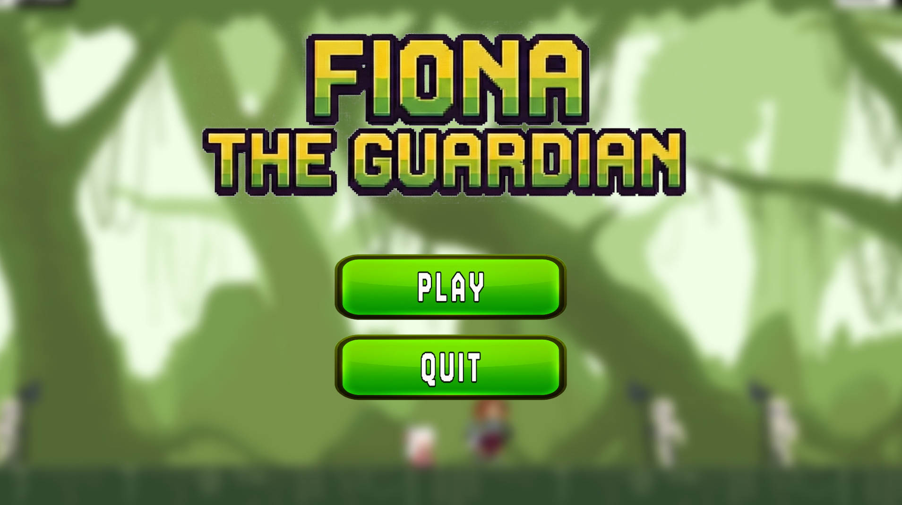
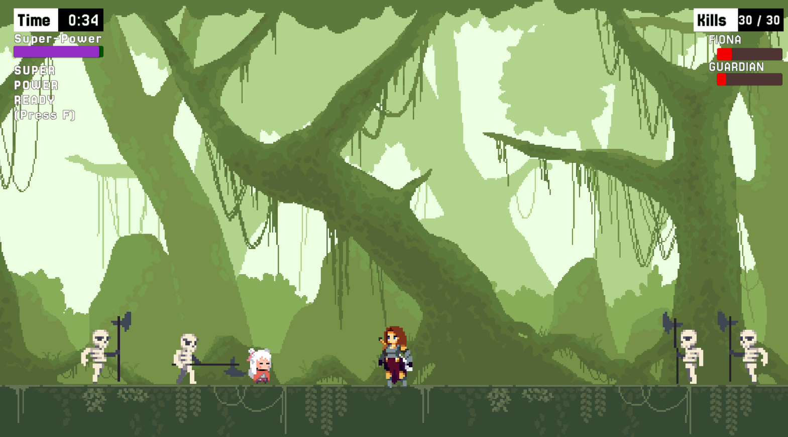
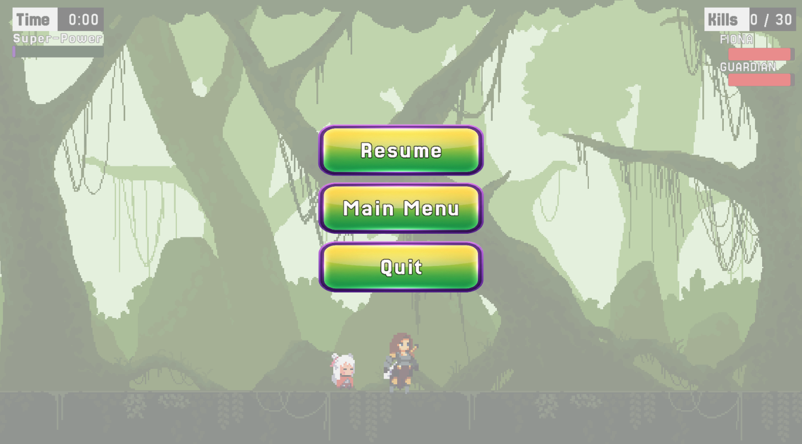
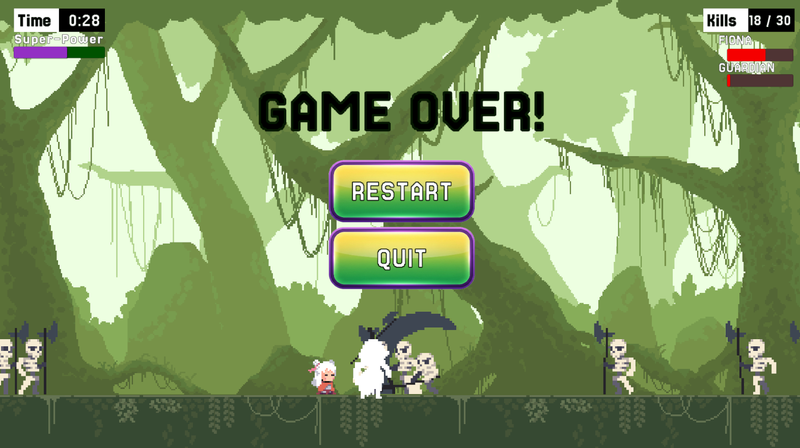
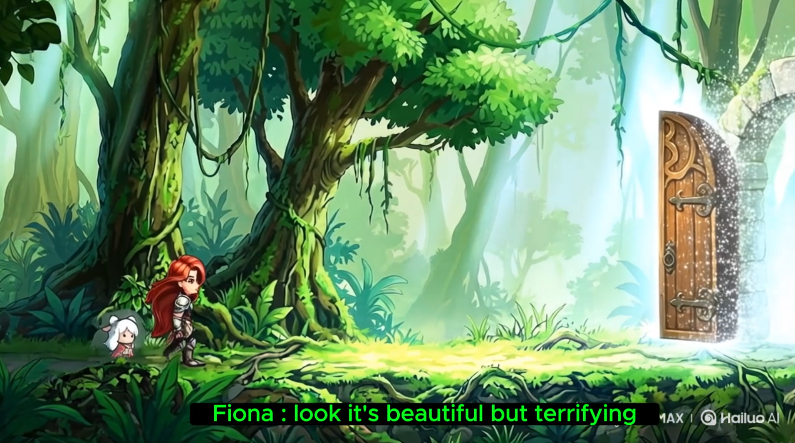

# 🛡️ FIONA-THE-GUARDIAN

> **A Unity 2D Action/Defense Game (Portfolio Project)**

**FIONA-THE-GUARDIAN** is a fast-paced 2D level demo where the player must balance offense and defense. Your mission is simple but challenging: protect a vital object from waves of incoming enemies while keeping yourself alive.

This project demonstrates core game development concepts in Unity, including health systems, UI management, cutscene integration, and finite state machines for gameplay flow.

---

## 📖 About the Game

In this Level 1 demo, players step into the shoes of a guardian. You aren't just fighting for your own survival; you must defend a strategic objective. As you defeat enemies, you build up a "Super Power" meter. Once fully charged, you can unleash a devastating ability that triggers a cinematic cutscene to clear the level.

---

## 🔥 Key Features

* **⚔️ Action-Packed Gameplay:** Smooth 2D player movement with jump and attack mechanics.
* **🛡️ Dual Health System:**
    * **Player Health:** Monitor your own vitality.
    * **Objective Health:** Protect the "Object-to-Protect" at all costs.
* **💀 Game Over Logic:** The game ends if *either* the player dies OR the protected object is destroyed.
* **🔋 Super Power System:**
    * Fill the power bar by defeating enemies.
    * **Visual Cue:** UI displays "Super Power Ready" when the bar is full.
    * **Cinematic Finish:** Activate to trigger a video cutscene and win the level.
* **⏸️ Complete UI Flow:**
    * **Pause Menu:** Seamlessly pause, resume, or quit.
    * **Game Over Screen:** Options to Restart or Quit.
* **🔊 Immersive Audio:** Background music and sound effects for jumping, attacking, and explosions.

---

## 🎮 Controls

| Action | Key |
| :--- | :--- |
| **Move Left** | `A` or `←` |
| **Move Right** | `D` or `→` |
| **Jump** | `Space` |
| **Attack** | `Left Mouse Click` |
| **Super Power** | `F` (When Ready) |
| **Pause Game** | `ESC` |

---

## 🛠️ Tech Stack

* **Engine:** Unity (2D)
* **Language:** C#
* **UI:** Unity UI (Sliders, Panels, Buttons), TextMeshPro
* **Media:** Unity VideoPlayer (for cutscenes)

---

## 📂 Project Structure

* `Assets/` - Contains all Scripts, Scenes, Animations, UI Prefabs, Audio, and Sprites.
* `Packages/` - Unity package dependencies.
* `ProjectSettings/` - Input and Project configurations.

---

## 🚀 How to Run

1.  **Clone the repository:**
    ```bash
    git clone [https://github.com/DananajyaPemarathna/FIONA-THE-GUARDIAN.git](https://github.com/DananajyaPemarathna/FIONA-THE-GUARDIAN.git)
    ```
2.  Open **Unity Hub**.
3.  Click **Add** and select the cloned folder.
4.  Open the project (Recommended Unity Version: 2022.3 LTS or later).
5.  Navigate to `Assets/Scenes` and open the **MainMenu** or **Level1** scene.
6.  Press **Play**!

---

## 📸 Screenshots

| Main Menu | Gameplay Action |
| :---: | :---: |
|  |  |

| Pause Menu | Game Over |
| :---: | :---: |
|  |  |

<p align="center">
  <b>✨ Cinematic Cutscene ✨</b><br>
  
</p>

---
---

---

## 👨‍💻 About the Developer

**Dananajya Pemarathna**

I am a passionate Game Developer with a keen interest in Unity (C#) and 3D Modeling. This project, **FIONA-THE-GUARDIAN**, was created as a portfolio piece to demonstrate my skills in:
* Implementing 2D Physics and Movement.
* Managing Game States (Game Over, Pause, Win).
* Creating interactive UI and Cutscene integration.

I am constantly learning and building new things. Feel free to check out my other repositories!

* 🌐 **GitHub:** [DananajyaPemarathna](https://github.com/DananajyaPemarathna)
* 📧 **Contact:** [mr.dananjayapemarathna@gmail.com]
* 💼 **LinkedIn:** [www.linkedin.com/in/dananjaya-pemarathna]

---
*Created by Dananajya Pemarathna*